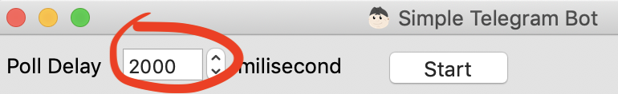
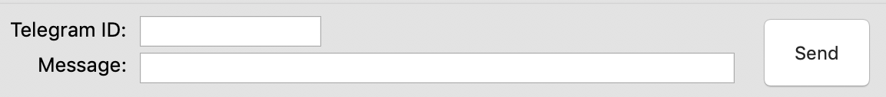

# Simple Telegram Bot - Desktop

## What is it?

**Telegram Bot** ini adalah bot telegram sederhana yang dibangun dengan menggunakan bahasa **Pascal** menggunakan framework [FastPlaz](https://fastplaz.com). Dijalankan di desktop, bukan sebagai _services_.

Pengoperasiannya sederhana, cukup menjalankan aplikasinya di laptop/pc, selama jaringan internet telah terhubung.

Di telegram-bot ini belum disediakan NLP untuk handle pesan yang masuk. Jika ingin menyematkan NLP, coba baca bagian bawah README ini.


## Why use it?

**Ringan Tanpa Beban**

Sebagian teman-teman mendapatkan kesulitan saat mengimplementasikan telegram bot dalam method hook. Mengingat harus menyediakan server/vps/hosting untuk menangkap hit dari telegram, dan juga perlu seting SSL juga. Memang ada yang free, tapi tetep sebagian diantara kita merasakan kesulitan.

Nahh...
Dengan telegram-bot ini, anda cukup menjalankan aplikasi ini di laptop/pc. Cukup menyediakan koneksi internet yang baik.

Aplikasi ini ringan, bahkan ringan tanpa beban. Bisa dikompilasi antar platform untuk dijalankan baik di Windows, Linux maupun Mac.


## How to use it


### Requirements

- [FastPlaz_runtime](http://www.fastplaz.com/)

### Instalasi

**install requirement**

Download kode sumber aplikasi Telegram Bot dan _package_ FastPlaz dengan cara berikut ini (menggunakan git):

```bash
$ mkdir -p TelegramBot/source/vendors
$ cd TelegramBot/source
$ git clone -b development https://github.com/luridarmawan/telegram-bot.git

# install vendors
#   change to branch development if needed

$ cd vendors
$ git clone -b development https://github.com/fastplaz/fastplaz.git

```

Anda boleh mengunakan cara lain untuk mendapatkan kode sumber ini, misalkan dengan download langsung dari link github yg tersedia.

Kemudian _compile_ (tidak perlu install) paket ini:

- tools/fastplaz_runtime.lpk
- tools/fastplaz_integration.lpk

**Build Telegram Bot dari IDE**

Melalui Lazarus, buka file `"src/bot.lpi"` dan *compile* file tersebut. 

Akan terbentuk file binary di 'bin/bot*'

***Configuration***

Konfigurasi menggunakan telegram bot ini sangat sederhana, cukup buka file `bin/config.json`, kemudian cantumkan telegram token anda.

```json
{
  "telegram": {
    "default": {
      "token": "your-telegram-here"
    }
  }
}
```

Bagaimana cara mendapatkan bisa anda dapatkan informasinya melalui media online yang tersedia. Mudah kok.

Jika kompilasi berjalan baik dan konfigurasi telah benar, coba jalankan aplikasi telegram bot tadi.
Kira-kira tampilannya akan seperti ini.


Jika tombol start diaktifkan, Bot akan secara periodik mengambil data pesan dari server telegram, dan mengirimkan pesan balik berupa **echo** dari pesan yang dikirim sebelumnya.

**Telegram Bot Installation**

Tidak ada instalasi secara khusus dari aplikasi ini. Selama jaringan internet tersedia, Anda bisa menjalankan aplikasi ini di laptop/pc anda.


## USAGE

Aplikasi secara periodik mengambil informasi pesan dari Telegram. Interval waktu bisa ditentukan sendiri melalui aplikasi ini, disarankan cukup 2000 atau 3000 mili detik saja.



Disediakan fitur untuk mengirimkan pesan secara manual.



Masukkan telegram-ID yang dituju dan pesan yang akan dikirimkan, kemudian tekan tombol 'Send'. Log hasil pengiriman ditampilkan di Page Log #2

### Custom Message

Tentu anda ingin membuat pesan balasan yang _custom_ khan? Mudah kok.

Dari IDE/Editor favorit anda, buka file project `bot.lpi`, nama berkas `main.pas`, lalu cari prosedur `onMessageHandler`. Prosedur inilah yang akan menangani arus pesan yang masuk. Pesan yang masuk disematkan di dalam parameter `AMessage`.


Jika pesan akan diabaikan dan tidak mengirimkan perlu balasan, cukup langsung `Exit` saja atau dengan memberikan nilai `False` ke variable `AHandled`.

### Catatan

Aplikasi ini adalah contoh membuat bot telegram yang sederhana, belum ada NLP-nya dan bukan untuk kebutuhan trafik yang tinggi.

Untuk penggunaan dengan trafik yang tinggi, saya menyarankan untuk menggunakan telegram bot yang memanfaatkan method webhook.
 
Untuk kebutuhan ini, anda bisa menggunakan [Carik Bot](https://carik.id) yang ada di mana-mana, di banyak layanan pesan singkat seperti Telegram, Facebook Messenger, Line, Instagram, bahkan ada pula untuk Android App.

## Video Compilasi Source

_*belum tersedia_

## Referensi

- [Carik Telegram Bot - Webhook](https://github.com/luridarmawan/carik)
- [Stemming Word dalam Carik](https://medium.com/@luridarmawan/stemming-word-dalam-carik-da3b802038c8)
- [Natural Language Processing (NLP) sederhana dari Carik Bot](https://medium.com/@luridarmawan/natural-language-processing-nlp-sederhana-dari-carik-bot-78952b618695)

